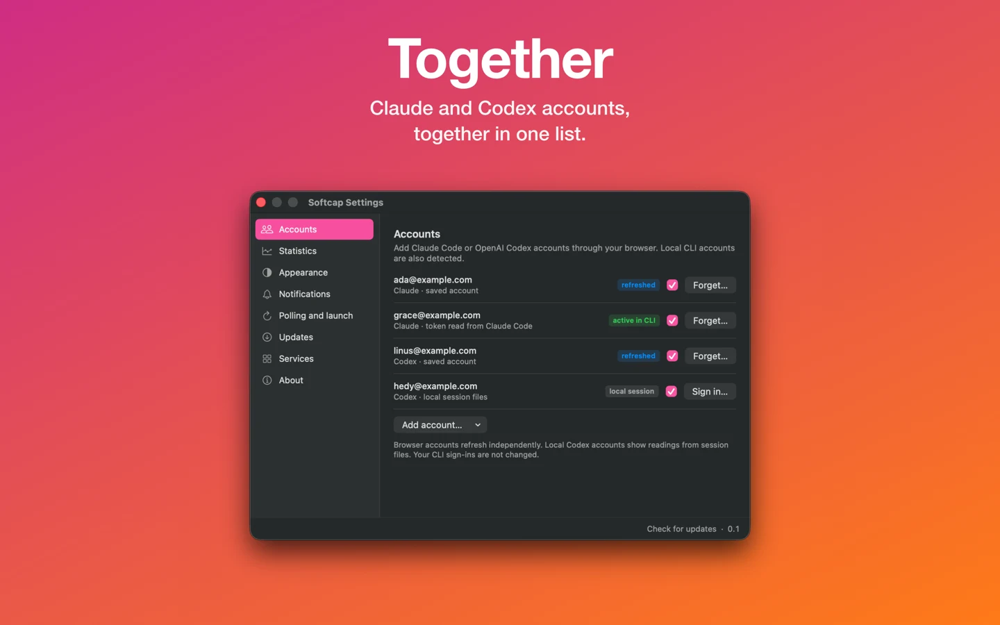
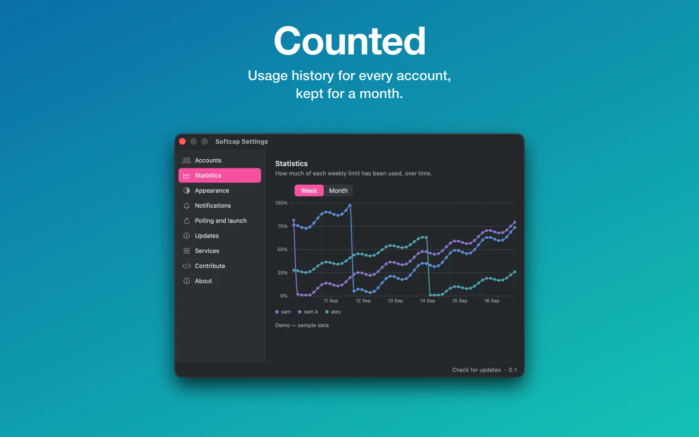
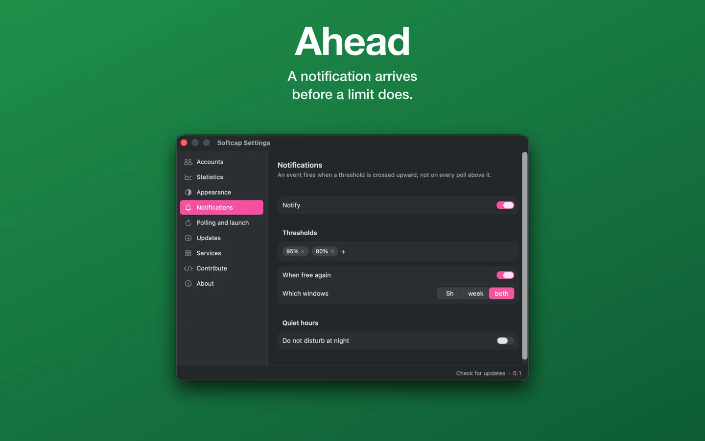
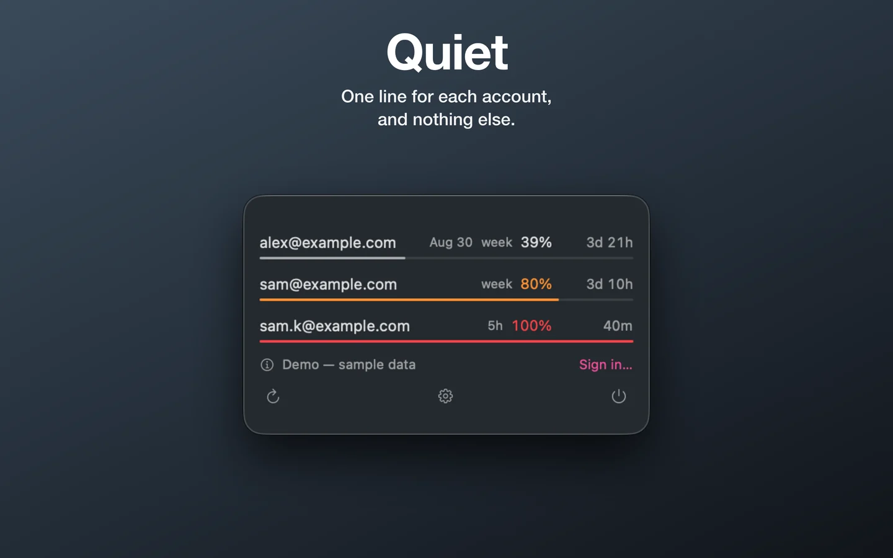

# Softcap

Claude Code and OpenAI Codex subscription limits in the macOS menu bar.
macOS 14+ · SwiftUI · WidgetKit.


## Screens

<!--
  This strip scrolls sideways on github.com, and the mechanism is easy to break
  by accident. GitHub styles every table `width: max-content; max-width: 100%;
  overflow: auto`, and every image `max-width: 100%`. An image therefore shrinks
  until the row fits the column, and the row never overflows: four screens at
  `width="420"` render at 226 px apiece, with no scrollbar. Text under `nowrap`
  cannot shrink, so it is the caption that sets each column's floor. Each caption
  below is one unbreakable line wider than 420 px, which holds the column open,
  keeps the screen at its full 420 px, and pushes the row past the column so the
  scrollbar appears. Shorten a caption and the screens quietly shrink again.
-->

<table>
<tr>
<td align="center" nowrap>
<a href="docs/screenshots/02-accounts.webp"></a>
<br><b>Accounts</b> · Claude and Codex accounts, together in one list
</td>
<td align="center" nowrap>
<a href="docs/screenshots/03-statistics.webp"></a>
<br><b>Statistics</b> · how much of each weekly limit is used, over time
</td>
<td align="center" nowrap>
<a href="docs/screenshots/04-notifications.webp"></a>
<br><b>Notifications</b> · thresholds and recovery alerts, with quiet hours
</td>
<td align="center" nowrap>
<a href="docs/screenshots/05-minimal.webp"></a>
<br><b>Minimal window</b> · the same readings, in a window with less chrome
</td>
</tr>
</table>

Drag the strip sideways for the rest; each screen links to its full-size image.

## Build and run

<!-- download:start -->
### [⬇︎ Download Softcap 0.1.38](https://github.com/milushov/softcap/releases/latest/download/Softcap.dmg)

A disk image for macOS 14 and later. Released 24 September 2026 — [all versions](https://github.com/milushov/softcap/releases/tag/v0.1.38).
<!-- download:end -->

Or from the [Mac App Store](https://apps.apple.com/app/id6811539739) — the
same app, sandboxed and updated by the store instead of by itself. That copy
still checks for a newer version, against the store's own record, and says so
in the menu and on the Updates screen; the store does the installing, and asks
to quit Softcap first. The disk image above is the lane this repository builds,
and the one that carries the in-app updater.

### Opening it the first time

This is about the disk image; the App Store copy asks for none of it.
Current builds are signed ad-hoc rather than with an Apple Developer ID, so
macOS refuses the first launch. Right-click the app, choose **Open**, and
confirm once — that is the whole ritual. The terminal way, if you prefer it:

```sh
xattr -dr com.apple.quarantine /Applications/Softcap.app
```

The same ad-hoc signature is why macOS asks — once per update, and worded as
though the app were reaching into somebody else's data — to let Softcap use its
own App Group container, the one holding the widget's snapshot. Nothing outside
the app is read. A Developer ID signature removes both prompts, and the
[release workflow](.github/workflows/release.yml) switches to one as soon as the
signing secrets are configured.

Requires **Xcode 26+ / Swift 6.2+** and **XcodeGen** (`brew install xcodegen`).
For signed macOS builds, configure your development certificate and team in
`Signing.local.xcconfig` (git-ignored); see [Signing.xcconfig](Signing.xcconfig).

```sh
make test       # Core tests; no signing required
make test-auth  # Browser sign-in lifecycle tests with fake accounts
make build      # Build the macOS app and widget
make run        # Build and launch the macOS app
make build-ios  # Build for the iOS simulator; no certificate required
make run-ios    # Build and launch in an installed iPhone simulator
```

To compile the macOS app without a signing identity:

```sh
make project
xcodebuild -project Softcap.xcodeproj -scheme Softcap -configuration Debug \
  -derivedDataPath build CODE_SIGNING_REQUIRED=NO CODE_SIGNING_ALLOWED=NO build
```

Unsigned builds cannot use the App Group for widget data and history storage.
The [release workflow](.github/workflows/release.yml) builds macOS on pushes to
`main` that change the app — the release notes list the commits that did — then
signs and packages a DMG and ZIP. A push that changes only the site, the store
listing or a tool runs the tests and publishes nothing.

## Accounts and usage

Open **Settings → Accounts → Add account…**, choose **Claude Code** or
**OpenAI Codex**, and sign in in the browser. Repeat for each subscription.
After saving, Softcap returns to Accounts. **Sign in…** reconnects an account;
**Forget…** removes its saved Softcap credentials.

| Source | Readings |
|---|---|
| Claude | Live usage from `api.anthropic.com/api/oauth/usage`; browser grant |
| Codex | Live usage from `chatgpt.com/backend-api/wham/usage`; browser grant |

Every account is added through the browser and holds a grant of its own. Softcap
reads one keychain item — the one it writes itself — and no files belonging to
either CLI, so nothing here asks for permission and usage checks send no
prompts. Signing out of a CLI, or signing into a different account there,
changes nothing in Softcap.

A list written by an older build may hold a token copied from Claude Code.
Softcap never spends one: the server rotates a refresh token when it is used,
which would sign the CLI out. Such a row asks to be signed in through the
browser once, and then holds a credential of its own.

## Features and defaults

| Feature | Behavior |
|---|---|
| Limits | Five-hour and weekly usage, reset countdowns, reading age |
| Accounts | Hide accounts; sort by load, name, or **Custom** drag-and-drop order |
| Notifications | Thresholds at **80% / 95%** by default, recovery alerts, quiet hours; messages name the limit window |
| Polling | Every **60 s** with the window open, **300 s** in the background; configurable |
| Appearance | System, light, dark; optional minimal window; ten languages including Arabic RTL; VoiceOver |
| Mac widgets | All four sizes: small, medium, large, extra large; data comes from the app |
| Demo | Sample accounts with limits filling and resetting, shown until you sign in; switched on the Accounts screen |
| Statistics | Weekly-limit charts over the last week or month, built from the readings the app has taken |
| Updates | A daily check by default, and again while Settings → Updates is open — against GitHub's release feed, or the App Store's record in the store copy; the disk-image copy installs from the menu or that screen, the store copy opens the App Store |

Settings open with **⌘,**. Nine sections: Accounts, Statistics, Appearance,
Notifications, Polling and launch, Updates, Services, Contribute, About and data.

History keeps a reading when usage moves by a point, at most every five minutes,
plus one every half hour regardless while polling; pruned after 35 days.
Cursor, GitHub Copilot and Gemini CLI are placeholders, not implemented providers.

## Data

- **Credentials:** Keychain service `StatusChecker-accounts` (legacy name).
- **Settings:** `~/Library/Preferences/app.softcap.Softcap.plist`.
- **Widget and history:** `snapshot.json` and `history.json` in the App Group
  container; widgets make no network requests.
- **Error reports:** scrubbed failure details, app version and event metadata go
  to `sentry.softcap.app`. Enabled by default in release builds; disable in
  **Settings → About and data → Send error reports**. Debug builds do not report.

## iOS prototype

The iOS 17+ app and widgets share the Mac's models and views. Home-screen widgets
support small, medium and large sizes; lock-screen widgets support the circle and
rectangle — two of the three accessory shapes.

**Account sync from the Mac and sign-in on the phone are not implemented.**
The current Keychain store is local, so a fresh iOS install has no accounts.
Device builds need signing and provisioning; the Makefile targets the simulator.

## Development

| Path | Contents |
|---|---|
| `App/`, `Widget/` | macOS app, settings and widget |
| `iOS/`, `iOSWidget/` | iOS prototype and widgets |
| `Packages/Core/` | Providers, credentials, monitoring, preferences, shared UI, updates and diagnostics |
| `Tests/AuthenticationTests/` | macOS browser controller and loopback listener tests |

Core logic has no AppKit dependency. User-facing strings belong in the ten
`StatusUI` translation catalogues.

```sh
tools/install-hooks.sh             # Install the pre-commit hook once per clone
tools/decisions-index [substring]  # Find decisions by heading, date and line
tools/mutate <file> <old> <new> -- <command>
```

The hook runs the Core suite, including ten checks for private data in files and
commit history. Mutation testing requires a clean file and restores it from a
copy. Exit codes: **0** — the check failed; **1** — the check passed with the file
broken; **2** — the mutation could not be made.

## Site

`site/` contains the landing page for [softcap.app](https://softcap.app/).

```sh
site/check-widths.sh    # Check layout at 320–1920 px (requires Chrome)
site/deploy.sh --status # Compare local files with HTTPS responses; no SSH
site/deploy.sh          # Deploy through SSH and verify
site/deploy.sh --rollback
```

Deploy runs a width check and verifies SHA-256, Cache-Control, the proxy's saved
state and the container's restart policy. It keeps the previous files and server
configuration for rollback.

## References

- [Authentication](docs/authentication.md) — sign-in, credential ownership and usage sources.
- [Decision log](docs/DECISIONS.md) — append-only rationale; search with `tools/decisions-index`.
- Historical [specs](docs/superpowers/specs/), [plans](docs/superpowers/plans/)
  (start with the note in that directory), and [mockups](docs/design/).
- [Translation helper](tools/add_strings.py) — update all ten catalogues.

## Licence

[MIT](LICENSE). Read the source, change it, and send the change back — the
**Contribute** screen in Settings links the repository and its issues.
